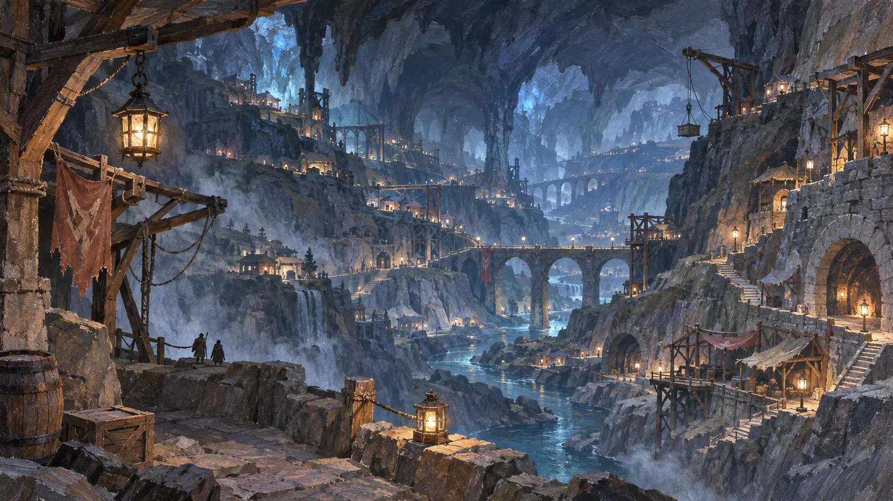

# ルオスエンを歩く

川船で来た旅人も、地下の魔導船を降りた人も、この街で誰かと出会う。市場には地下の産品が届き、酒場には帰還者の話が集まる。街を歩くなら、まずその足元に広がる世界から覗いてみよう。

## 街の下へ

ルオスエンの迷宮は、ただの坑道でも、怪物と宝箱が順番に並ぶ施設でもない。地図に載る道の先で、形も広さも異なる地下世界が続いている。

### どこまでも広がる、未知の景色

> 岩棚の向こうを川が流れ、別の高さに道が続く。植物の生える空洞も、足場のない断崖もある。地下を飛ぶ船の航路と、人が歩いて辿れる場所は同じではない。
>
> すべてを描き切った地図はない。次の曲がり角の向こうが、誰かの知っている道とは限らない。

### 探す、確かめる、道を拓く

> 地形を測る者、鉱脈を探す者、植物を採る者、行方不明者を捜す者。地下へ向かう理由は一つではない。危険な生き物もいれば、戦わずに通り抜ける知恵が必要な道もある。
>
> 昨日までただの空白だった場所が、今日の記録によって、明日の旅人の道になる。そんな小さな仕事も冒険だ。

### 見つけて、持ち帰る

> 新しい魔石の産地、珍しい薬材、古い遺構、由来の分からない品。持ち帰ったものから街の仕事が生まれる。何を宝物だと思うかは、人によって違う。
>
> 「最下層へ辿り着けば願いが叶う」という噂さえある。誰もがその話を信じているわけではないし、真実も分からない。君なら何を探してみたいだろう。

## モグラの寝床

> 泥のついた荷物を下ろすと、煮込み料理の匂いがする。地下へ潜る者たちを「モグラ」と呼んでいた時代、その呼び名を面白がった初代店主、通称**モグラの大将**が開いた宿だ。
>
> 一度でも地下迷宮に潜った者なら、安価で寝床を借りられる。駆け出しの探索者の住まいと食事を支える習わしは、商館が大きくなった今も続いている。ここで聞く帰還者の話が、次の冒険のきっかけになることもある。
>
> 君は初めてこの宿を訪れたのだろうか。それとも、いつもの席があるのだろうか。

## モグラ商館

> 一軒の宿から始まった商いは、今では**モグラ商館**へと発展した。依頼の取次、契約と報酬、地下で見つけた品の売買仲介を担う。駆け出しの頃に世話になった探索者たちが、長い年月をかけて築いた信用がある。
>
> 周囲の市場には買付人が集まり、独立した酒場では仲間探しや帰還祝いが続く。大きな商いのときには今でもモグラの大将の声がする、なんて与太話を聞くこともある。初代が持ち帰ったと伝わる魔法の品を超えるものが、迷宮の最下層に眠ると期待する人もいる。
>
> 君が持ち帰ったものに、どんな値をつける人がいるだろうか。

## 王立地図院

> **王立地図院**では、新しく確かめられた道が地図に書き加えられていく。セレド王国が滅びた今も、唯一「王立」の名を守る機関だ。そこで働く灯守（ひもり）は、地下に人々が行き交う主要な道を造る。利益のためだけではなく、次の世代が歩く道を拓く。
>
> 地図の空白には、まだ確かめられていない場所がある。王国時代の地図には閲覧を禁じられたものがある、という噂も聞く。ただし、その地図が本当に存在するか、何を記しているかは分からない。
>
> 君は古い道を辿りたいだろうか。それとも自分の手で新しい道を描きたいだろうか。

## 竜骨亭

> 高い岩天井の下を、船がゆっくり渡っていく。**竜骨亭（りゅうこつてい）**は地下を行く魔導船を造り、修理する人々の拠点だ。
>
> かつて魔導船は地上の空を飛んだ。今はマナに満ちた地下空洞が航路になっている。未知の高純度魔石があれば、また地上の空へ戻れるのではないか――そう期待する船匠もいる。ただし、実現するという証明はない。
>
> 船を造る者にも、その船で働く者にも、まだ知らない材料を探す者にも道がある。

## 伽藍の塔

> 地表から地下へ、今も日々伸び続ける逆さの塔。**伽藍の塔（がらんのとう）**では魔術の教育と研究、魔導具の開発・製作に加え、地下の生態系や未知の生物の研究も行われている。迷宮から持ち帰られた標本や観測の記録は、教室で新たな問いになる。
>
> 塔が日々伸びる仕組みはまだ分からない。説明できない現象があれば、学ぶ者も自分の足で確かめに行く。探索者の発見が研究を変え、研究が新しい探索の方法を生むこともあるだろう。
>
> 君が持ち帰りたいのは、珍しい物だろうか。それとも答えだろうか。

## 摩天楼

> 天を目指す高い塔の足元に、地下から持ち帰られた魔石が集まる。山師が見つけ、鉱夫が掘り出した石は、職人の目と手を通って使えるものになる。**摩天楼（まてんろう）**は、魔石の純度を鑑定・加工し、魔導具の開発・製作も担う技術者たちの組織だ。魔導具を巡っては伽藍の塔と競い合っている。
>
> 迷宮から持ち帰った一かけらの石が、街の灯りや道具、魔導船を動かす力へ変わる。限られた魔石をより有効に使い、技術を経済の力で育てる。合理性を重んじ、失われた文明を取り戻し、さらに高みへ――その野心を名前に感じさせる。だから、新しい産地や珍しい原石を見つけた者の話に、職人たちは耳を傾ける。
>
> 君には売りたい発見があるだろうか。それとも自分の手で作りたいものがあるだろうか。

## 星路教会

> 迷宮の最奥で、神に会った者がいるという。その帰還者を開祖とするのが**星路教会（セイロ）**だ。彼が歩んだ道は、星を巡る路――**星路**と呼ばれている。巡礼者は地下に点在するいくつかの場所を星の名で呼び、一つずつ訪れてゆく。
>
> 正確な地図はとうに失われ、頼れるのは開祖の口伝と、先人の巡礼の足跡ばかり。それでも人々は星を探す。彼らが目指すのは、開祖が神に会ったと伝わる最奥の聖地に、再び辿り着くことだ。
>
> 君にとって地下への旅は、祈りだろうか。調査だろうか。誰かとの約束だろうか。

**まだ、この街のほんの入口だ。** 河港の荷役人、宿屋の主人、市場の商人、地下の植物を採る人々。七つの場所の外にも暮らしと仕事は続いている。

この街で育った人物も、昨日やって来た人物も、自分なりの理由で地下へ向かえる。特定の組織に所属する必要はない。

*情景画は世界を想像するための表現です。描かれた地形・建築・遺構の細部は確定設定を示すものではありません。噂の真偽も保証しません。*

[この街でどんな冒険ができる？](../adventures/次の冒険.md)
